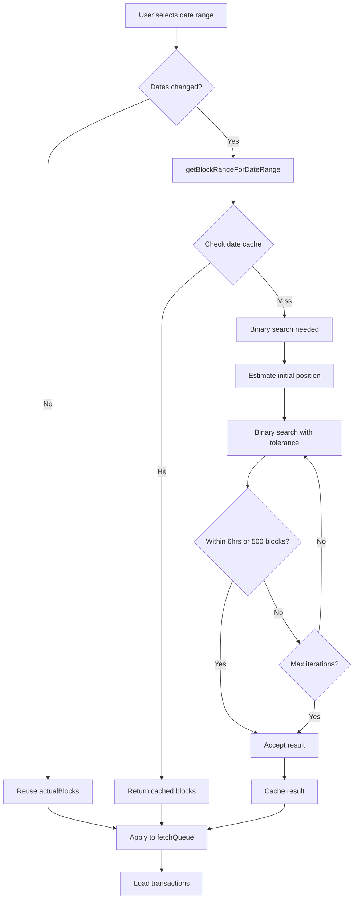
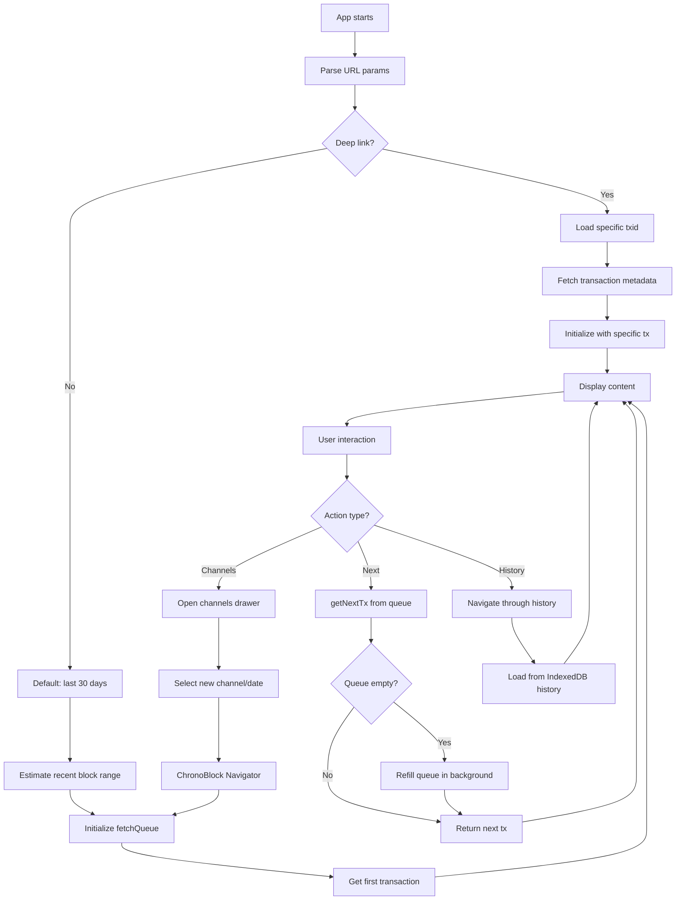
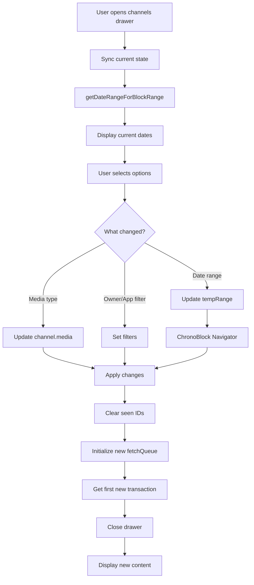
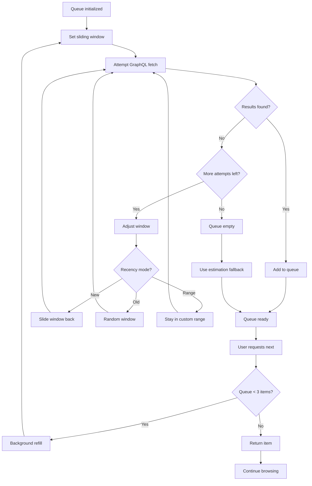
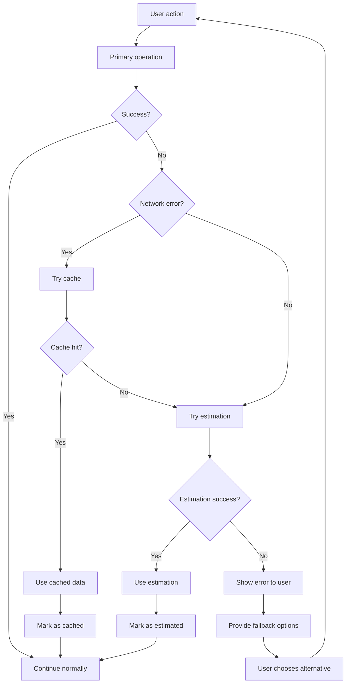
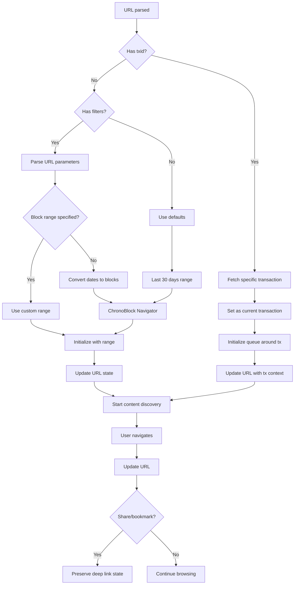

# Roam App Flow Diagrams

## 1. ChronoBlock Navigator - Date to Block Resolution

## 2. Main App Content Discovery Flow

## 3. Channel Selection and Filtering Flow

## 4. FetchQueue Background Refill Strategy

## 5. Error Handling and Fallback Chain

## 6. Deep Link and URL State Management

## Key Design Principles

1. **Graceful Degradation**: Every operation has fallbacks (cache → estimation → error)
2. **Performance First**: Aggressive caching and background operations
3. **User Experience**: Instant feedback with estimation, accurate results with binary search
4. **Resilience**: 404-resistant design that skips bad content automatically
5. **State Preservation**: Deep linking and URL state for sharing/bookmarking