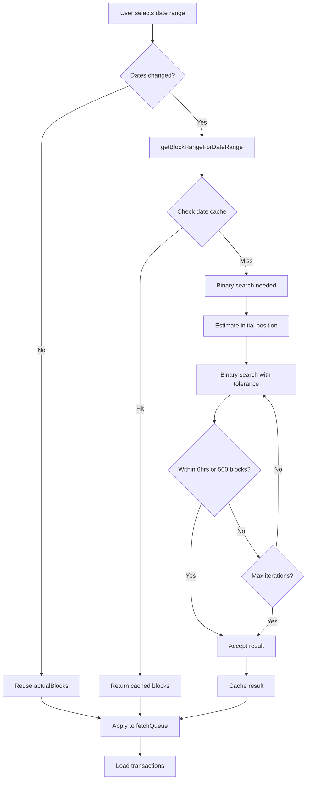
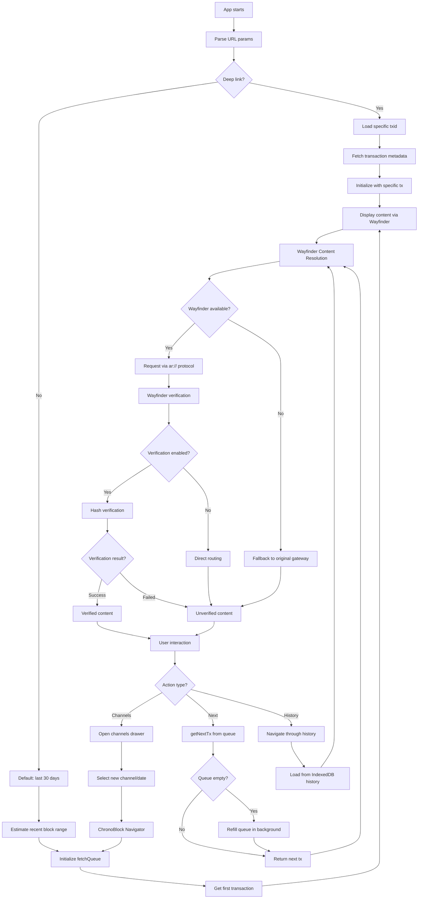
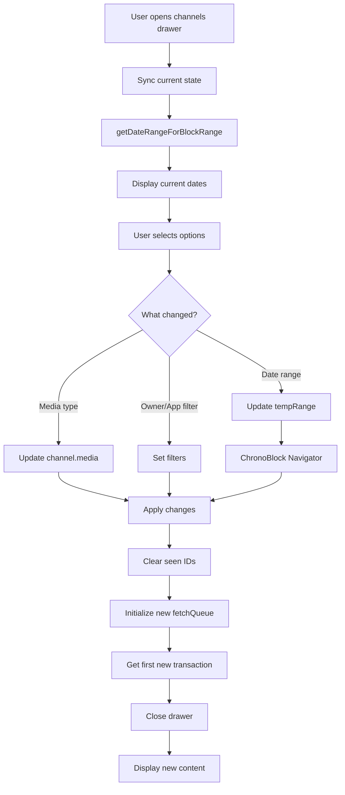
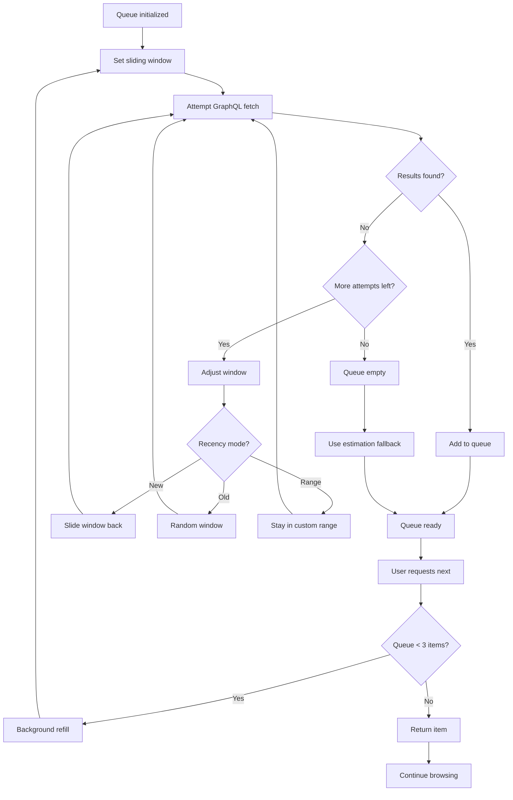
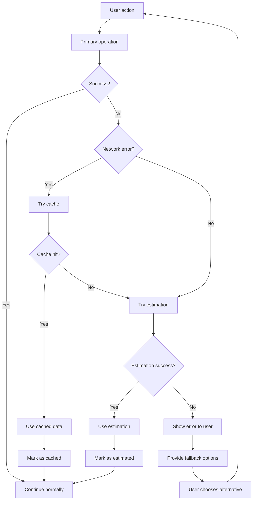
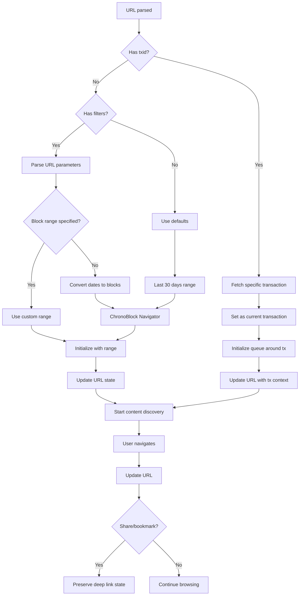
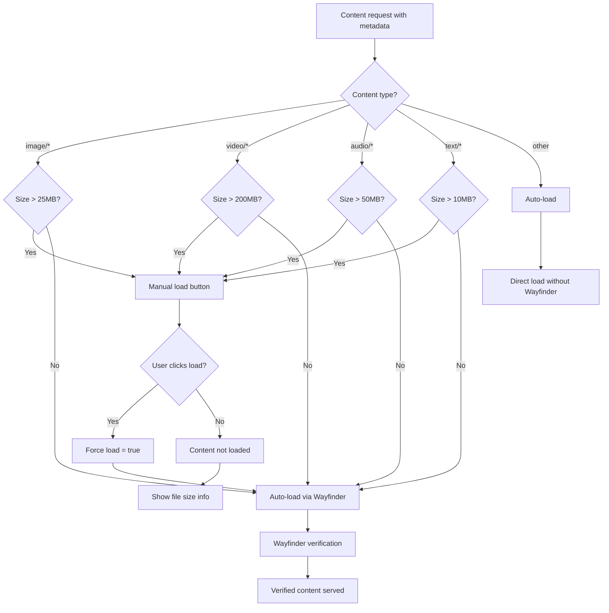

# Roam App Flow Diagrams

## 1. ChronoBlock Navigator - Date to Block Resolution



## 2. Main App Content Discovery Flow with Wayfinder



## 3. Channel Selection and Filtering Flow



## 4. FetchQueue Background Refill Strategy



## 5. Error Handling and Fallback Chain



## 6. Deep Link and URL State Management



## 7. Wayfinder Integration and Verification Flow (v0.2.0)

```mermaid
flowchart TD
    A[Content Request with size/type] --> B{Size threshold check}
    B -->|Too large| C[Return URL-only response]
    B -->|Auto-load| D{Check content cache}
    
    C --> E[Show manual load button]
    E --> F{User clicks?}
    F -->|Yes| G[Force load = true]
    F -->|No| H[Skip loading]
    G --> D
    
    D -->|Cache hit| I[Return cached content + current status]
    D -->|Cache miss| J[Register event listener]
    
    J --> K[Initialize Wayfinder]
    K --> L{Wayfinder enabled?}
    L -->|No| M[Use fallback gateway]
    L -->|Yes| N[Create ar:// URL]
    
    N --> O[Set status: verifying]
    O --> P[Emit verification-started]
    P --> Q[Wayfinder.request()]
    
    Q --> R[Dynamic Gateway Selection]
    R --> S[NetworkGatewaysProvider]
    S --> T[AR.IO mainnet with stake sorting]
    
    T --> U[Route to selected gateway]
    U --> V{Verification enabled?}
    
    V -->|No| W[Return gateway URL + content]
    V -->|Yes| X[Start hash verification]
    
    X --> Y[Trusted gateways: permagate.io, vilenarios.com]
    Y --> Z[Compare x-ar-io-digest headers]
    Z --> AA{Hashes match?}
    
    AA -->|Yes| BB[Mark as verified]
    AA -->|No| CC[Mark as failed]
    
    BB --> DD[Emit verification-completed]
    CC --> EE[Emit verification-failed]
    
    DD --> FF[Update cached content status]
    EE --> FF
    FF --> GG[Notify event listeners]
    GG --> HH[UI updates verification indicator]
    
    W --> II[Cache content with status]
    II --> JJ[Return to app]
    
    M --> KK[Direct gateway request]
    KK --> LL[Set status: not-verified]
    LL --> JJ
    
    H --> MM[Content not loaded]
```

## 8. useWayfinderContent Hook - Race Condition Fix (v0.2.0)

```mermaid
flowchart TD
    A[useWayfinderContent called] --> B[txId provided?]
    B -->|No| C[Return empty state]
    B -->|Yes| D[Register event listener FIRST]
    
    D --> E[Start content fetch]
    E --> F[Call wayfinderService.getContentUrl()]
    F --> G[Wayfinder processes content]
    
    G --> H[Content processing completes]
    H --> I[Verification events fire]
    I --> J[Event listener catches events]
    J --> K[Update React state]
    
    K --> L[Get current verification status]
    L --> M[Return state with current status]
    
    M --> N{Status still verifying?}
    N -->|Yes| O[Set 2-second fallback timer]
    N -->|No| P[Complete]
    
    O --> Q[Check status after delay]
    Q --> R{Status now verified?}
    R -->|Yes| S[Update state with verified]
    R -->|No| T[Continue as unverified]
    
    S --> P
    T --> P
    
    C --> U[Early return]
    P --> V[Hook returns result]
    U --> V
```

## 9. Size-Aware Loading Thresholds (v0.2.0)



## 10. Preloading System with Wayfinder

```mermaid
flowchart TD
    A[Current content displayed] --> B[1-second delay]
    B --> C[peekNextTransactions(2)]
    C --> D[For each next transaction]
    
    D --> E{Content type?}
    E -->|Image (not GIF)| F[Preload via Wayfinder]
    E -->|Text/JSON| G[HEAD request via Wayfinder]
    E -->|Video/Audio| H[Skip preload]
    
    F --> I[Try Wayfinder first]
    G --> I
    I --> J{Wayfinder success?}
    
    J -->|Yes| K[Cache Wayfinder URL]
    J -->|No| L[Fallback to original gateway]
    
    K --> M[Add to preload cache]
    L --> N[Cache fallback URL]
    N --> M
    H --> O[Continue to next]
    
    M --> P{Cache size > 50?}
    P -->|Yes| Q[LRU cleanup - remove 25 oldest]
    P -->|No| R[Preload complete]
    Q --> R
    O --> R
```

## Key Design Principles (Updated for v0.2.0)

1. **Verified Content Delivery**: AR.IO Wayfinder integration with hash-based verification via trusted gateways
2. **Bandwidth Consciousness**: Size-aware loading with manual thresholds (25MB images, 200MB videos, 50MB audio, 10MB text)  
3. **Race Condition Prevention**: Event listeners registered before requests to catch all verification events
4. **Intelligent Caching**: TTL and LRU-based content caching with verification status synchronization
5. **Graceful Degradation**: Every operation has fallbacks (Wayfinder → original gateway → error)
6. **Performance First**: Throttled cache cleanup, single content fetches, memory-efficient Object URL management
7. **User Experience**: Transparent verification with subtle indicators that don't disrupt content flow
8. **Resilience**: 404-resistant design that skips bad content automatically
9. **State Preservation**: Deep linking and URL state for sharing/bookmarking
10. **Dynamic Gateway Routing**: AR.IO network integration with stake-based gateway selection
11. **Security**: Dual trusted gateway verification (permagate.io, vilenarios.com) for enhanced content integrity